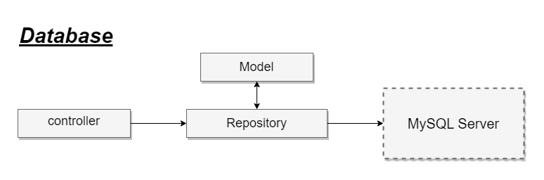

# Database: Getting Started

- [Introduction](#introduction)
    - [Configuration](#configuration)
- [Model](#model)
- [Repository](#repository)
- [Running SQL Queries](#running-queries)
- [Saga Transactions](#database-transactions)

<a name="introduction"></a>
## Introduction

Almost every modern web application interacts with a database. Lets makes interacting with databases extremely simple across a variety of supported databases using raw SQL, a [fluent query builder](/docs/{{version}}/queries), and the [Gorm ORM](/docs/{{version}}/eloquent). Currently, Lets provides first-party support for five databases:

<div class="content-list" markdown="1">

- MariaDB 10.3+ ([Version Policy](https://mariadb.org/about/#maintenance-policy))
</div>



<a name="configuration"></a>
### Configuration

The configuration for Lets's database services is located in your application's `config/database.go` configuration file. In this file, you may define all of your database connections, as well as specify which connection should be used by default. Most of the configuration options within this file are driven by the values of your application's environment variables. Examples for most of Lets's supported database systems are provided in this file.

By default, Lets's sample [environment configuration](/docs/{{version}}/configuration#environment-configuration) is ready to use  for developing Lets applications on your local machine. However, you are free to modify your database configuration as needed for your local database.

<a name="MySQL-configuration"></a>
#### MySQL Configuration

After the database has been created, you may easily configure your environment variables to point to this database by placing the absolute path to the database in the `DB_DATABASE` environment variable:

```ini
DB_HOST=localhost
DB_PORT=3306
DB_USERNAME=root
DB_PASSWORD=
DB_DATABASE=lets
```

<a name="integration"></a>
#### Integration

Anda perlu mendafarkan kedalam `config/database.go` untuk DSN, dan juga repository:

```go
package config

import (
	"lets-go-framework/app/repository"
	"lets-go-framework/lets/drivers"
	"lets-go-framework/lets/types"
	"os"
)

func Database() {
	drivers.MySQLConfig = &types.MySQL{
		Host:       os.Getenv("DB_HOST"),
		Port:       os.Getenv("DB_PORT"),
		Username:   os.Getenv("DB_USERNAME"),
		Password:   os.Getenv("DB_PASSWORD"),
		Database:   os.Getenv("DB_DATABASE"),
		Charset:    "utf8mb4",
		ParseTime:  "True",
		Loc:        "Local",
		Debug:      true,
		Repository: repository.User,
	}
}
```


<a name="model"></a>
## Model

Model adalah struct yang mendefinisikan tabel. Baca dokumentasi Gorm ORM untuk mendapatkan detail, berikut adalah isi dari`app/models/users.go`

```go
package models

type User struct {
	ID              uint   `json:"id" gorm:"column:id;type:autoIncrement;primaryKey"`
	Name            string `json:"name" gorm:"column:name"`
	Email           string `json:"email" gorm:"column:email"`
	EmailVerifiedAt string `json:"email_verified_at" gorm:"column:email_verified_at"`
	Password        string `json:"password" gorm:"column:password"`
	RememberToken   string `json:"remember_token" gorm:"column:remember_token"`
	CreatedAt       string `json:"created_at" gorm:"column:created_at"`
	UpdatedAt       string `json:"updated_at" gorm:"column:updated_at"`
	DeleteAt        string `json:"delete_at" gorm:"column:delete_at"`
}

```

<a name="repository"></a>
## Repository

Repository adalah fungsi yang bertugas untuk melakukan eksekusi query ke database server. Fungsi `func SetAdapter(db *gorm.DB)` harus selalu ada didalam repository untuk menyimpan koneksi ke dalam struct.

```go
package repository

import (
	"lets-go-framework/app/models"
	"lets-go-framework/lets"

	"gorm.io/gorm"
)

// Define repository.
var User = &user{}

// Repository user.
type user struct {
	db *gorm.DB
}

// Implement types.IMySQLRepository.
// Mandatory.
func (tbl *user) SetAdapter(db *gorm.DB) {
	tbl.db = db
}

// Get all user data.
// This function will be called from the controller.
func (tbl *user) Get() (result []*models.User, err error) {
	response := tbl.db.Find(&result)
	lets.LogI("Get.RowsAffected: %v", response.RowsAffected)

	if err = response.Error; response.Error != nil {
		lets.LogE("Example.Get(): ", err)
		return
	}

	return
}
```

<a name="running-queries"></a>
## Running SQL Queries

Once you have configured your database connection, you may run queries using the `DB` facade. The `DB` facade provides methods for each type of query: `select`, `update`, `insert`, `delete`, and `statement`.

<a name="running-a-select-query"></a>
#### Running A Select Query

To run a basic SELECT query, you may use the `select` method on the `DB` facade:

```go
package controllers

import (
	"fmt"
	"lets-go-framework/app/adapters/data"
	"lets-go-framework/app/repository"
	"lets-go-framework/lets"
)

// Example controller get users
func DatabaseExample() (response data.ResponseExample, err error) {
	// Repository call
	data, err := repository.User.Get()
	if err != nil {
		return
	}

	// Create output to terminal
	for _, u := range data {
		lets.LogI(u.Name)
	}

	// Send back response to adapter
	response.Greeting = fmt.Sprintf("We have %v users!", len(data))

	return
}
```

The first argument passed to the `select` method is the SQL query, while the second argument is any parameter bindings that need to be bound to the query. Typically, these are the values of the `where` clause constraints. Parameter binding provides protection against SQL injection.

The `select` method will always return an `array` of results. Each result within the array will be a GO `stdClass` object representing a record from the database:

